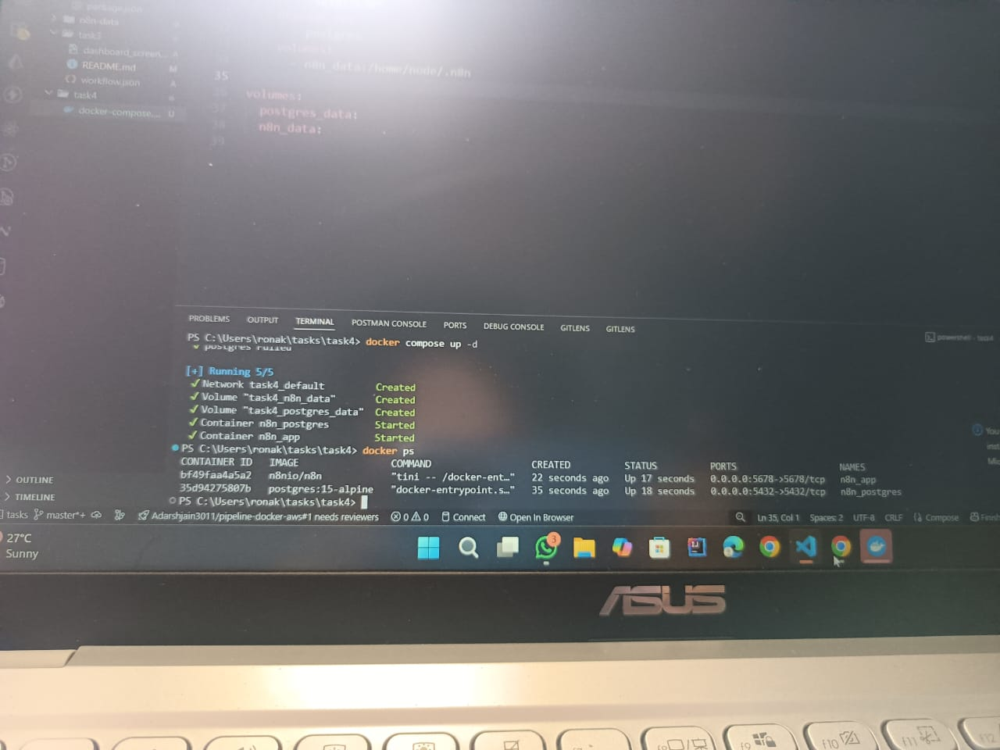

# Task 4 - n8n + PostgreSQL using Docker Compose

This setup runs n8n workflow automation tool along with PostgreSQL as the database.

## Steps to run

1. Run: `docker compose up -d`
2. Visit: `http://localhost:5678`

## Services Used

- **n8n** (workflow automation)
- **PostgreSQL** (database)

## Ports

- n8n → 5678
- PostgreSQL → 5432

## Verification

- Run `docker ps` to ensure both containers are running.
- Open n8n dashboard in browser.

  
  
